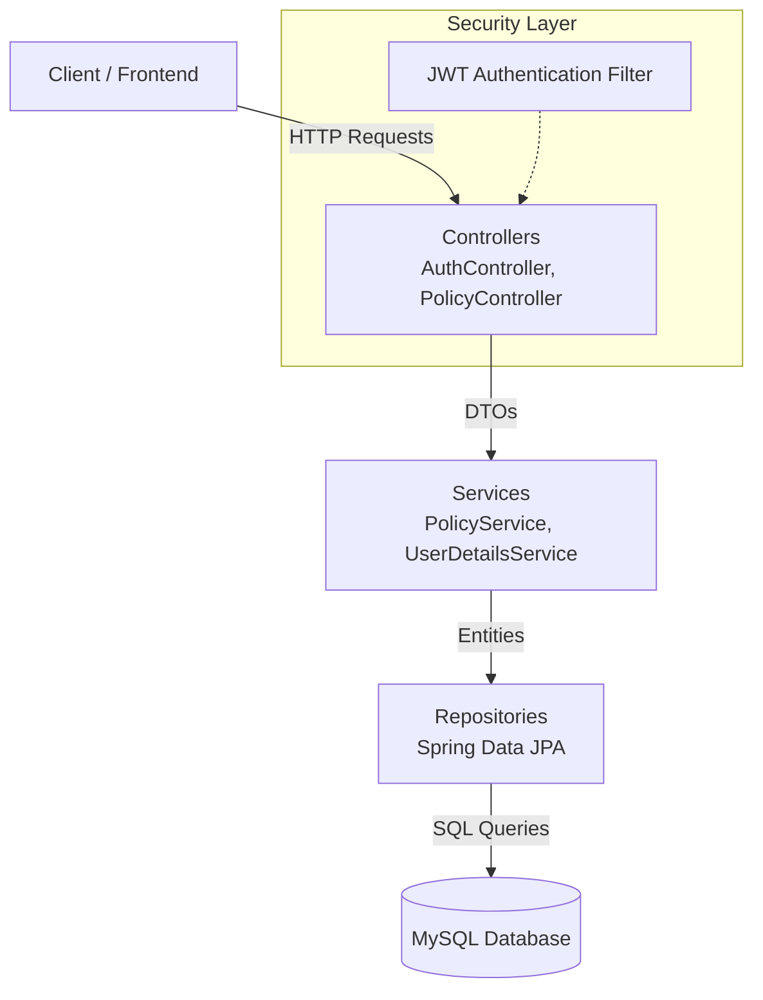
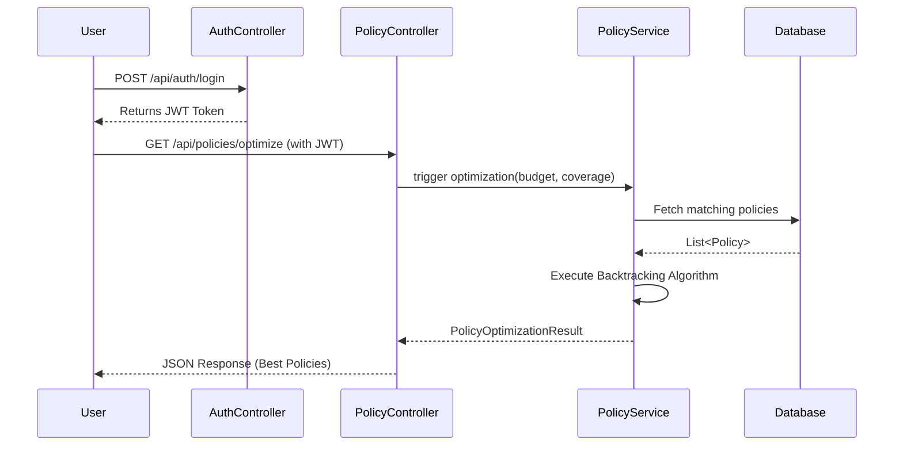

<div align="center">

# 🛡️ Insurance Policy Selection Optimizer

[](https://www.oracle.com/java/)
[](https://spring.io/projects/spring-boot)
[](https://www.mysql.com/)
[](https://jwt.io/)
[](#49-project-status)
[](#42-license-section)


**A powerful, algorithm-driven InsurTech platform to help users select the most optimal insurance policies.**

</div>

---

<details>
<summary><b>Table of Contents (Click to expand)</b></summary>

1. [Project Description](#3-project-description)
2. [Problem Statement](#4-problem-statement)
3. [Solution Overview](#5-solution-overview)
4. [Key Features](#6-key-features)
5. [Project Objectives](#7-project-objectives)
6. [System Architecture Overview](#8-system-architecture-overview)
7. [Technology Stack](#9-technology-stack)
8. [Database Information](#12-database-information)
9. [Project Workflow](#13-project-workflow)
10. [Algorithm/Optimization Logic Used](#14-algorithmoptimization-logic-used)
11. [Folder Structure](#15-folder-structure)
12. [Installation Guide](#16-installation-guide)
13. [API Documentation](#23-api-documentation)
14. [Screenshots](#26-screenshots-section)
15. [Testing Strategy](#33-testing-strategy)
16. [Author Information](#43-author-information)

</details>

---

## 3. Project Description
The **Insurance Policy Selection Optimizer** (internally known as *Suraksha Shield*) is an advanced backend system tailored for the InsurTech domain. It assists users, insurance brokers, and administrators in managing, comparing, and ultimately selecting the most suitable insurance policies. Through its robust API and custom optimization engine, the platform processes complex customer parameters to recommend policy combinations that maximize coverage while strictly adhering to premium budgets.

## 4. Problem Statement
Choosing the right insurance policy is overwhelmingly complex for the average consumer. Customers must balance high premiums against sufficient coverage, while navigating endless policy types, risk levels, and provider reputations. Without intelligent tooling, consumers often end up overpaying for redundant coverage or under-insuring themselves against critical risks.

## 5. Solution Overview
This project provides a programmatic solution by introducing an **Optimization Engine** powered by a recursive backtracking algorithm. Instead of presenting a static list of policies, the system accepts a user's absolute maximum budget and minimum coverage requirements, mathematically evaluating thousands of potential policy combinations to return the most cost-effective and comprehensive coverage plan available.

## 6. Key Features
- **Intelligent Policy Optimization:** Algorithmically calculates the best combination of policies based on user constraints.
- **Role-Based Access Control (RBAC):** Distinct administrative and standard user privileges securely enforced.
- **JWT Authentication:** Stateless, secure API access using JSON Web Tokens.
- **Full CRUD Operations:** Comprehensive management of policies, users, and admin profiles.
- **Dynamic Filtering:** Search policies by risk level, provider, name, and type.
- **Automated Database Seeding:** Instant environment setup with pre-populated dummy data for testing.

## 7. Project Objectives
- To simplify the insurance selection process for end-users.
- To demonstrate complex algorithmic problem-solving within a modern web framework.
- To provide a scalable, secure, and easily extensible backend architecture for future InsurTech applications.

---

## 8. System Architecture Overview

The system follows a classic Multi-Tier Architecture (Controller-Service-Repository pattern):



## 9. Technology Stack
Our stack is chosen for enterprise-grade reliability, security, and developer productivity.

## 10. Programming Languages Used
- **Java 17**: Utilizing the latest LTS features like Records and Pattern Matching where applicable.

## 11. Frameworks and Libraries Used
- **Spring Boot 3.2.5**: Core framework for rapid application development.
- **Spring Web (MVC)**: For building RESTful web services.
- **Spring Data JPA**: For seamless ORM and database interactions.
- **Spring Security**: For robust application-level security.
- **JJWT (0.11.5)**: For generating and parsing JSON Web Tokens.
- **Maven**: Dependency management and build automation.

## 12. Database Information
- **Database:** MySQL
- **Driver:** `mysql-connector-j`
- **ORM:** Hibernate (via Spring Data JPA)

---

## 13. Project Workflow



## 14. Algorithm/Optimization Logic Used
The core of this project is the **Backtracking Optimization Algorithm** housed in the `PolicyService`. 

**How it works:**
The algorithm recursively evaluates all valid combinations (subsets) of filtered insurance policies. For each policy, it branches into two decisions:
1. **Include** the policy (if it doesn't exceed the `maxPremium` budget).
2. **Exclude** the policy.

As it traverses the decision tree, it keeps track of the combination that meets the `coverageMin` requirement while resulting in the absolute lowest combined premium. Once the recursion tree is fully traversed, the mathematically proven optimal combination is returned.

---

## 15. Folder Structure

```text
InsurancePolicyOptimizer/
├── src/
│   ├── main/java/com/suraksha/shield/
│   │   ├── config/          # Security, JWT, and DB Seeder configurations
│   │   ├── controller/      # REST API Endpoints (Auth, Policy, Admin, User)
│   │   ├── dto/             # Data Transfer Objects for API payloads
│   │   ├── entity/          # JPA Entities (User, Admin, Policy)
│   │   ├── exception/       # Global exception handlers
│   │   ├── repository/      # Spring Data JPA Interfaces
│   │   └── service/         # Business logic and Optimization algorithms
│   └── test/                # Unit and Integration Tests
├── pom.xml                  # Maven dependencies
└── README.md                # Project documentation
```

---

## 16. Installation Guide

### 17. Prerequisites
- **Java Development Kit (JDK) 17** or higher.
- **Maven 3.8+** installed.
- **MySQL 8.0+** server running locally or remotely.
- **Git** (for version control).

### 18. Environment Setup
1. Clone the repository:
   ```bash
   git clone https://github.com/Shreyas-Kumbhar/InsurancePolicyOptimizer.git
   cd InsurancePolicyOptimizer
   ```
2. Create a new MySQL database named `suraksha_db` (or whatever is defined in your properties).

### 19. Configuration Steps
Update your `src/main/resources/application.properties` with your database credentials:
```properties
spring.datasource.url=jdbc:mysql://localhost:3306/suraksha_db
spring.datasource.username=root
spring.datasource.password=your_password
spring.jpa.hibernate.ddl-auto=update
```

### 20. Running the Project Locally
Run the Spring Boot application using Maven:
```bash
mvn spring-boot:run
```
The server will start on `http://localhost:8080`.

### 21. Build Instructions
To create an executable JAR file for production:
```bash
mvn clean install
```
The compiled JAR will be located in the `target/` directory.

### 22. Deployment Instructions
*(Currently configured for local/Docker deployment. For cloud environments like AWS EC2 or Heroku, push the JAR file and ensure environment variables for database connections are securely set).*

---

## 23. API Documentation (if applicable)
*Endpoints are protected via JWT. Include `Authorization: Bearer <token>` in headers.*

| Method | Endpoint | Description | Role Required |
|--------|----------|-------------|---------------|
| POST | `/api/auth/login` | Authenticate and get JWT | None |
| GET | `/api/policies` | Get all policies | USER/ADMIN |
| POST | `/api/policies` | Create a new policy | ADMIN |
| GET | `/api/policies/optimize` | Run optimization engine | USER/ADMIN |

### 24. Input Parameters (Optimization Endpoint)
- `maxPremium` (Integer): Maximum affordable budget.
- `coverageMin` (Integer): Minimum required coverage.
- `type` (String, Optional): specific policy type (e.g., Health, Life).

### 25. Output Results
The API returns a `PolicyOptimizationResult` object containing:
- `isOptimized` (Boolean)
- `totalPremium` (Integer)
- `totalCoverage` (Integer)
- `recommendedPolicies` (Array of Policy objects)

---

## 26. Screenshots Section
*(Placeholders for future screenshots)*
| Login Interface | Optimization Results | Admin Dashboard |
|:---:|:---:|:---:|
|  |  |  |

---

## 27. Sample Use Cases
- A young professional wants maximum health coverage but cannot spend more than $1,500/year.
- A family requires combined Auto and Home insurance, aiming for a cumulative coverage of $1,000,000 without exceeding $3,000 in premiums.

## 28. Example Scenarios
**Scenario A:** User sets `maxPremium=5000` and `coverageMin=500000`. The engine evaluates 50 policies and recommends taking *Policy A (Health)* and *Policy D (Life)* because their combined premium is $4,800 and total coverage is $550,000, beating all other combinations.

## 29. Performance Benefits
By filtering policies by type and risk level *before* applying the backtracking algorithm, the time complexity is significantly reduced, ensuring lightning-fast API response times even as the database grows.

## 30. Security Considerations
- **Stateless Auth:** JWT prevents session hijacking.
- **Password Hashing:** Passwords are never stored in plain text (Spring Security PasswordEncoder).
- **CORS Configuration:** Restricts API access to authorized frontend domains.

## 31. Scalability Considerations
The RESTful, stateless nature of the application allows it to be easily dockerized and scaled horizontally across multiple instances behind a load balancer.

## 32. Future Enhancements
- Implement Machine Learning to predict risk levels.
- Add caching (Redis) for frequently requested policy combinations.
- Integrate a payment gateway for instant policy purchasing.

---

## 33. Testing Strategy
- **Unit Testing:** Validating individual Service methods (especially the Backtracking logic).
- **Integration Testing:** Ensuring the Controller-Service-Repository flow works seamlessly with the test database.
- **Security Testing:** Verifying unauthorized access is properly rejected (401/403 HTTP statuses).

## 34. Test Cases Summary
Tests ensure that the optimization algorithm never exceeds the budget, correctly handles edge cases (like impossible budget/coverage constraints), and that JWT tokens expire correctly.

## 35. Challenges Faced
Implementing the backtracking algorithm efficiently was a challenge. Initial iterations suffered from exponential time complexity ($O(2^N)$). This was resolved by implementing strict pruning conditions (stopping branches early if the current premium exceeds the max budget).

## 36. Learning Outcomes
- Deepened understanding of Spring Security and JWT filter chains.
- Practical application of Data Structures and Algorithms (Backtracking) in a real-world business context.

---

## 37. Project Impact
This project bridges the gap between complex financial products and consumer understanding, making insurance accessible and transparent.

## 38. Business Value
For insurance brokerages, integrating this API can drastically increase conversion rates by offering customers mathematically proven "best deals" instantly, fostering trust and satisfaction.

---

## 39. Contribution Guidelines
1. Fork the Project
2. Create your Feature Branch (`git checkout -b feature/AmazingFeature`)
3. Commit your Changes (`git commit -m 'Add some AmazingFeature'`)
4. Push to the Branch (`git push origin feature/AmazingFeature`)
5. Open a Pull Request

## 40. Code Style Guidelines
- Follow standard Oracle Java Conventions.
- Use meaningful variable names.
- Write Javadoc comments for complex algorithmic methods.

## 41. Version Control Strategy
- `main` branch for production-ready code.
- `dev` branch for active development.
- Feature branches for specific tasks (`feature/login-ui`, `bugfix/jwt-expiration`).

---

## 42. License Section
This project is licensed under the **MIT License**. See the `LICENSE` file for details.

## 43. Author Information
**Shreyas Kumbhar**
- **Role:** Full Stack Developer / Backend Engineer
- **GitHub:** [@Shreyas-Kumbhar](https://github.com/Shreyas-Kumbhar)

## 44. Contact Information
- **Repository:** [https://github.com/Shreyas-Kumbhar/InsurancePolicyOptimizer.git](https://github.com/Shreyas-Kumbhar/InsurancePolicyOptimizer.git)

## 45. Acknowledgements
- Spring Boot Documentation
- OpenAI / AI Assistance for architectural best practices
- The open-source Java community

## 46. References
- [Spring Framework Reference](https://spring.io/projects/spring-framework)
- [Backtracking Algorithms Explained](https://en.wikipedia.org/wiki/Backtracking)

## 47. FAQ Section
**Q: Can I use this with PostgreSQL instead of MySQL?**
A: Yes! Simply change the JDBC URL and driver dependency in the `pom.xml`.

**Q: How does the algorithm handle thousands of policies?**
A: Currently, strict database filtering is applied first. For massive datasets, dynamic programming (knapsack implementation) or heuristic approaches (like Genetic Algorithms) would be implemented in future versions.

## 48. Roadmap
- [x] Initial Backend Architecture
- [x] Optimization Engine Implementation
- [x] JWT Security
- [ ] Frontend React Dashboard
- [ ] Redis Caching implementation

## 49. Project Status
🟢 **Active** - Actively maintained and open for contributions.

## 50. Support Section
If you encounter any issues or have questions, please [open an issue](https://github.com/Shreyas-Kumbhar/InsurancePolicyOptimizer/issues) in the GitHub repository.

---
<div align="center">
<i>Crafted with ❤️ by Shreyas Kumbhar</i>
</div>
